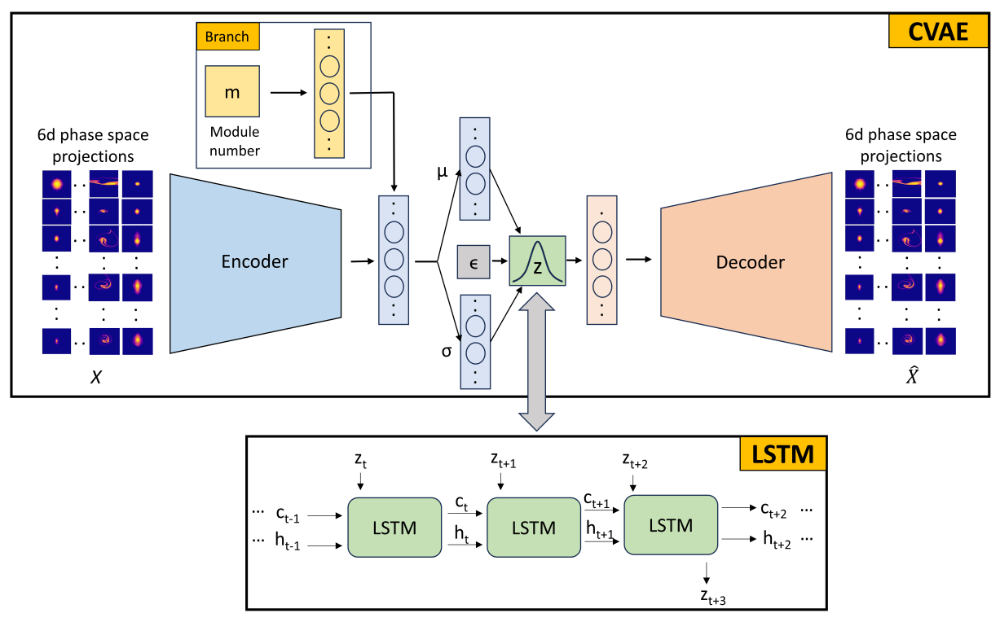
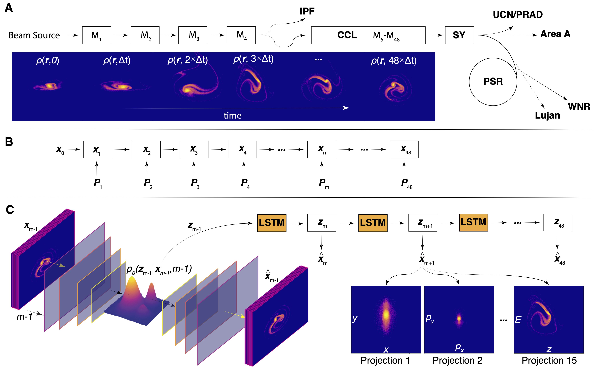
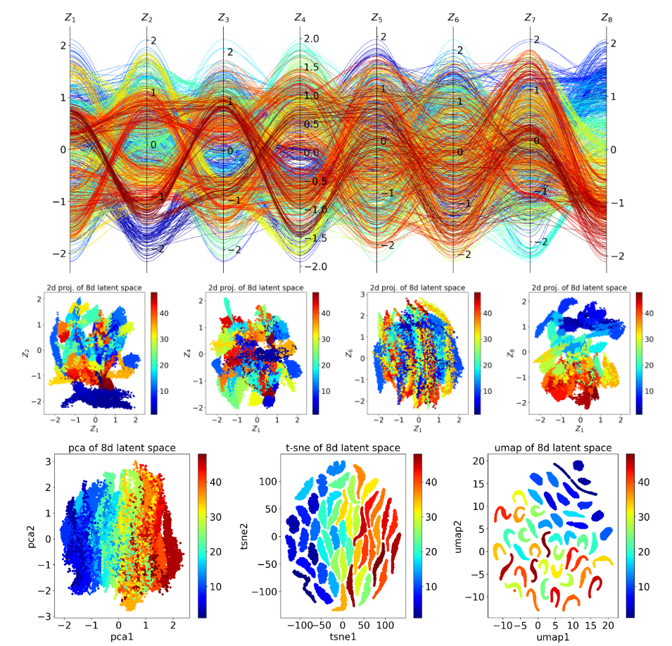

# CLARM 
- Note: The code is under scrutiny/review for open-source disclosure at Electronic Intake & Disclosure Reporting (eDIR is under Richard P. Feynman Center for Innovation), Los Alamos National Laboratory. It usually take a month. Once it is approved, the code will be uploaded directly to this repository.
### Conditional Latent Autoregressive Recurrent Model for spatiotemporal learning
##### CLARM is a unsupervised deep learning approach to learn spatiotemporal dynamics. CLARM consists of a CVAE and LSTM combined together in an autoregressive loop to learn spatial and temporal dynamics independently. Here, CVAE learns spatial correlations of the high dimensional objects in a low-dimensional latent space distribution and a RNN like Long Short-Term Memory (LSTM) learn the temporal dynamics within the latent space. Using CVAE part, new realistic samples can generated by conditionally sampling the latent space followed by decoding. Using LSTM part, the future states can be forecasted given few initial states as inputs. The proposed model addresses challenges faced by existing models in learning spatiotemporal dynamics, such as expensive computations in ConvLSTM and DCGAN, mixed spatial features and temporal dynamics in 3DCNN/4DCNN, computational complexity, lack of scalability, and robustness issues in GNNs, linear representation of data in the latent space through PCA-LSTM, and explainability concerns in the latent space with like AE-LSTM.

  

##### The CLARM is used to learn spatialtemporal evolution of 6D phase space of charged beams in particle accelerators. The model can generate phase space projections at various accelerator modules by sampling and decoding the latent space representation. The model also forecasts 6D phase space of charged particles in downstream modules from limited phase space information at upstream locations. This repository contains codes accompanying the [paper](https://arxiv.org/abs/2403.13858). The dataset accompying the paper is available at Zenodo.  

  

##### **Latent space visualization:**

  

##### **Generative ability of CLARM**:

  

##### **Forecasting ability of CLARM**:

  

For more information:  
1. [Link](https://arxiv.org/abs/2403.13858) of the paper: A conditional latent autoregressive recurrent model for generation and forecasting beam dynamics in particle accelerators.
2. The dataset accompying the paper is available at Zenodo.  
3. The basic source code for the creation of dataset comes from [HPSim](https://github.com/apphys/hpsim) (now inactive repository). The new version HPSim is available with LANL, not opensourced. 

## About the repository:
1. The python code is written using pytorch, cuda 11.8 and cudnn 8.x.
2. "main.py" is the main python file (run in spyder).
3. lib folder has .py files required to run "main.py"
